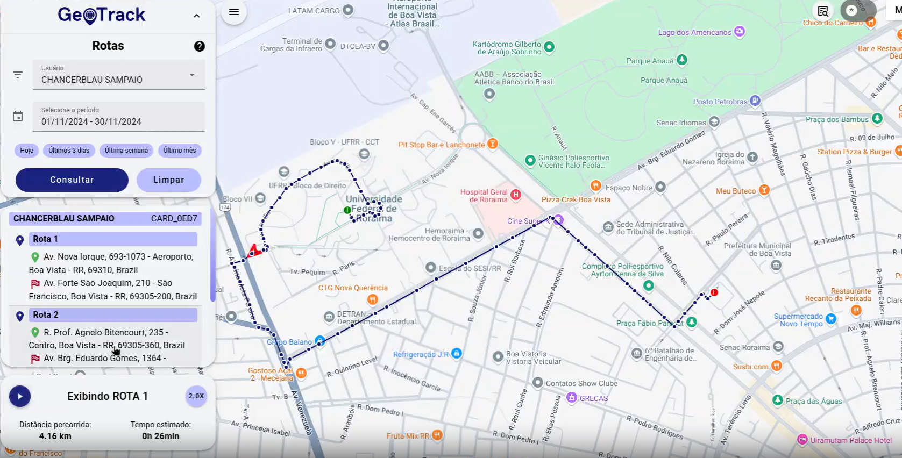

# **GeoTrack**

---

### **4º Semestre • Projeto Integrador Fatec-SJC**  

#### **Empresa parceira:** ITO1  
>A empresa ITO1 atua com soluções tecnológicas voltadas à integração, consultoria e gestão de infraestrutura e sistemas de geolocalização e rastreamento.

## Problema Proposto

O cliente necessitava de uma solução capaz de **gerenciar e consultar dados de geolocalização em tempo real**, vindos de dispositivos IoT.  
Os dados eram manipulados de maneira descentralizada e pouco intuitiva, dificultando o monitoramento de rotas, sessões e pontos de parada.

Além disso, havia a necessidade de:

- Tornar o rastreamento mais intuitivo com visualização em mapa.  
- Otimizar as operações logísticas e reduzir dependência técnica.  
- Oferecer uma plataforma segura e escalável para tomada de decisão baseada em dados.

#### Solução apresentada

---

Foi desenvolvida uma **aplicação Web completa**, oferecendo:

- Interface moderna e responsiva construída em Vue.js e Vuetify.  
- Backend seguro em Spring Boot, com autenticação, documentação e integração de dados.  
- Visualização geoespacial via OpenLayers.  
- Filtros avançados de usuários, dispositivos, sessões e áreas.  
- Monitoramento de rotas, sessões e pontos de parada em tempo real.

### **Requisitos Funcionais Concluídos**

- **Filtrar rastreamento por usuário, dispositivo e datas.**  
- **Visualizar pontos de parada, rotas e sessões diretamente no mapa.**  
- **Consultar registros por filtros rápidos (hoje, 3 dias, semana, mês).**  
- **Exibir áreas geográficas selecionáveis.**  
- **Documentar API via Swagger de maneira interativa.**  
- **Plotar elementos geoespaciais consumindo a API em tempo real.**

### **Requisitos Não Funcionais**

- **Garantir segurança das rotas e endpoints sensíveis.**  
- **Alta disponibilidade da aplicação por meio de containerização.**  
- **Interface rápida, responsiva e intuitiva.**  
- **Estrutura organizada para manutenção futura e escalabilidade.**  
- **Logs de API e operações garantindo rastreabilidade.**

---

## Tecnologias Utilizadas

| Tecnologia | Motivo de uso |
| --- | --- |
|  | Framework principal utilizado para construção do frontend. |
|  | Base do backend, garantindo segurança, escalabilidade e rapidez no desenvolvimento. |
|  | Banco de dados geoespacial utilizado para armazenar rotas, sessões e pontos. |
|  | Biblioteca para renderização e manipulação de mapas e elementos geográficos. |
|  | Documentação automática e interativa da API REST. |
|  | Containerização para padronização de ambiente e facilidade de deploy. |
|  | Versionamento de código e organização do repositório. |

VER MAIS DETALHES

## Minhas Contribuições

> **Função:** Desenvolvedor Fullstack

1. **Prototipação e Criação de Telas (Frontend)**  
   - Implementação de filtros (usuário, dispositivo, datas).  
   - Criação de layout responsivo com Vuetify.  
   - Integração visual com o mapa OpenLayers.
      <sumarry>Evidências</sumarry>
   

   

   

2. **Documentação da API (Swagger)**  
   - Organização dos endpoints REST.  
   - Configuração de documentação automática e padronizada.

3. **Integração OpenLayers + API Spring Boot**  
   - Plotagem de pontos de parada, sessões e rotas.  
   - Implementação de filtros rápidos (hoje, 3 dias, semana, mês).  
   - Implementação de áreas geográficas opcionais.
   <sumarry>Evidências</sumarry>
   

   
   
   

4. **Revisão de Código e Colaboração**  
   - Participação em reuniões Scrum.  
   - Revisão de pull requests.  
   - Suporte a boas práticas no repositório.

---

## Conhecimentos Obtidos

Durante o desenvolvimento do projeto, houve aprofundamento em:

- Arquitetura fullstack (Vue.js + Spring Boot).  
- Integração com mapas utilizando OpenLayers.  
- Boas práticas REST e documentação com Swagger.  
- Metodologias ágeis, Scrum e colaboração em equipe.  
- Manipulação de dados geoespaciais.  

