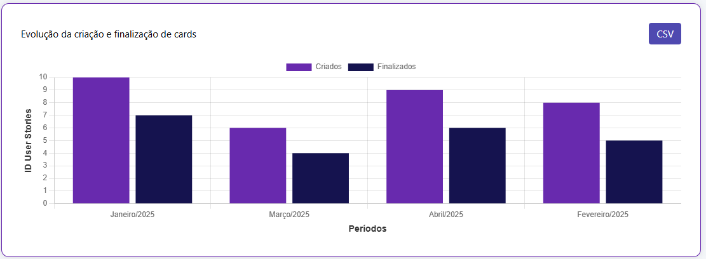
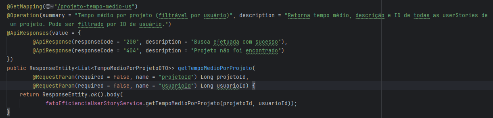
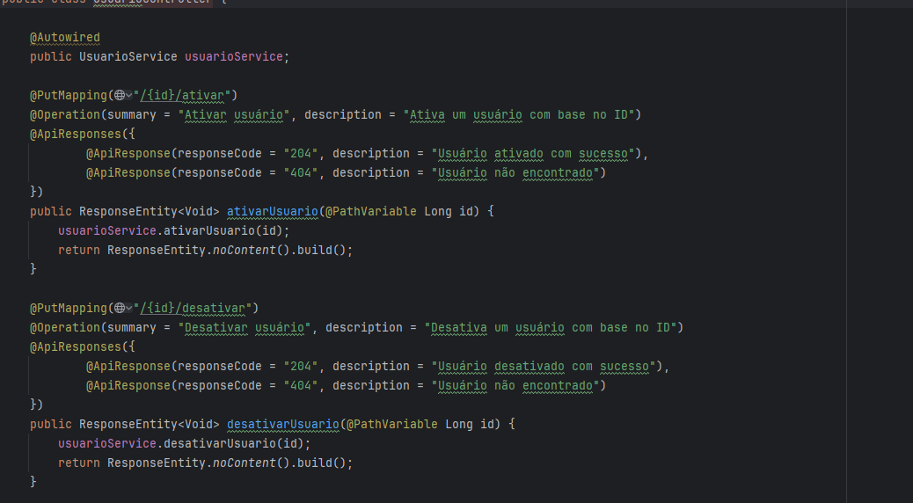

<div align="center"><h1>Stratify</h1></div>

**5º Semestre • Projeto Integrador Fatec-SJC**  
**Empresa Parceira:** [Youtan](https://youtan.com.br)
> A empresa Youtan se trata de uma fabrica de software, desenvolvendo diversos tipos de soluções para digitalização de processos e desenvolvimento de software para empresas, tais como apps mobile, webapps e concepção de produtos.


## Problema Proposto
 Atualmente, a equipe enfrenta desafios na visualização de indicadores essenciais do fluxo de trabalho, dificultando o acompanhamento do progresso dos projetos e a tomada de decisões estratégicas. A ausência de um painel centralizado que apresente métricas relevantes, como quantidade de cards criados em um período, tempo médio de finalização, e distribuição de tarefas entre os membros da equipe, torna a gestão menos eficiente e menos transparente.

#### Solução apresentada

---

Foi entregue uma aplicação Web que atendia plenamente aos requisitos definidos, oferecendo uma plataforma integrada ao kanban capaz de consolidar informações operacionais e estratégicas de forma visual, responsiva e orientada a indicadores. A solução apresenta métricas claras e filtráveis, permitindo análises ágeis sobre produtividade, planejamento, execução de sprints e comportamento do fluxo de trabalho.

Todos os dados exibidos são sincronizados com a ferramenta de gestão utilizada, garantindo consistência, além de aplicar políticas de acesso por níveis para assegurar que cada usuário veja apenas informações compatíveis com seu papel.

Sendo os requisitos funcionais concluídos abaixo:

- **Exibir a quantidade de cards por etiqueta**, sincronizando etiquetas com a ferramenta integrada e permitindo filtros por projeto e colaborador.
- **Apresentar o total de cards criados por período**, com níveis de visualização (colaborador/projeto) e gráficos em colunas para análise de tendência.
- **Mostrar a quantidade de cards finalizados por período**, também com filtros por nível e apresentação visual em gráficos.
- **Demonstrar a distribuição de cards por status**, permitindo análise por projeto ou colaborador, com dashboards interativos.
- **Calcular e exibir o tempo médio de execução dos cards**, considerando datas de criação e finalização, apoiando a identificação de gargalos.
- **Presentar a quantidade total de cards por colaborador**, com filtragem por projeto para análise de carga de trabalho.
- **Identificar retrabalhos**, contabilizando movimentações regressivas no fluxo e permitindo análise por colaborador e projeto.
- **Implementar controle de acesso por níveis (Operador, Gestor, Admin)**, garantindo que cada visualização e indicador respeite as permissões atribuídas.
- **Exibir a quantidade de cards por sprint**, sincronizada com o sistema externo e filtrável por projeto e por usuário.
- **Permitir exportação dos indicadores em CSV**, respeitando filtros aplicados e o nível de permissão do usuário.

Além destes, temos os seguintes requisitos não funcionais:

- **Documentação completa da API**, contendo endpoints, exemplos, parâmetros e códigos de erro, utilizando Swagger.
- **Responsividade total da aplicação**, garantindo experiência consistente em desktops e dispositivos móveis.
- **Disponibilização de manual do usuário**, com instruções passo a passo para uso, filtragem, interpretação dos indicadores e exportação dos dados.
- **Modelagem de banco de dados otimizada**, considerando integridade, normalização, índices e histórico necessário para cálculos como tempo médio e retrabalho.
- **Adoção de práticas de DevOps**, com CI, testes automatizados, versionamento de banco, rastreamento de requisitos e validação contínua por QA.

#### Tecnologias Utilizadas

| Tecnologia | Motivo de uso |
| --- | --- |
| | Framework principal no backend, com uma API REST, para integração ao frontend.  |
|  | Framework Web utilizado para construção de nosso frontend.|
| | Utilizado principalmente para a criação de ETL e obtenção de dados, além da criação de nossos algoritmos de predição.
|  | Utilizado como banco de dados principal da aplicação, alocando nosso data warehouse.
|| Utilizado primariamente para criação de tasks, controle de produtividade e alinhamento aos requisitos. |
 | Utilizado primariamente como versionamento de códigos, ramificações de branchs e afins. |
| | Utilizado para obtenção dos dados por meio de API, por meio de selfhost.
| | Utilizado para criação de levantamento de dados QA, integrado ao jira para extração de dados, neste caso, para demonstração de qualidade de código.
| | Utilizado para criação de levantamento de dados QA, integrado ao jira para extração de dados, neste caso, com foco em entrega de MVP e produtividade da equipe. |
|  | Containerização para padronização de ambiente e facilidade de deploy.


<details>
<summary align="left">VER MAIS DETALHES</summary>

#### Minhas Contribuições

> **Função:** Desenvolvedor fullstack- Devops(QA).

1. **Criações visuais**  
   - Gráfico de evolução e finalização de cards.
   - Gráfico de status dos cards

   <sumarry>Evidências</sumarry>
   <details>

   

   

   </details>
2. **Implementação de Spring Security JWT**  
   - Configuração de proteção de rotas.
   - Implementação de token em frontend.
   - Implementação de exceções e códigos de erros.
    <sumarry>Evidências</sumarry>
    <details>

   ```java

    public class SpringSecurityConfig {
    private static final String[] DOCUMENTATION_OPENAPI = {
            "/docs/index.html",
            "/docs-park.html", "docs-park/**",
            "/v3/api-docs/**",
            "/swagger-ui-custom.html", "/swagger-ui/index.html/**", "/swagger-ui/**",
            "/**.html", "/webjars/**", "/configuration/**", "/swagger-resources/**",
    };
    @Bean
    public SecurityFilterChain filterChain(HttpSecurity http) throws Exception {
        return http
                .csrf(csrf -> csrf.disable())
                .formLogin(form -> form.disable())
                .httpBasic(basic -> basic.disable())
                .authorizeHttpRequests(auth -> auth
                    .requestMatchers(HttpMethod.POST, "/auth/**").permitAll()
                    .requestMatchers(DOCUMENTATION_OPENAPI).permitAll()
                    .anyRequest().authenticated()
                )
                .sessionManagement(
                    session -> session.sessionCreationPolicy(SessionCreationPolicy.STATELESS)
                )
                .addFilterBefore(
                    jwtAuthorizationFilter(), UsernamePasswordAuthenticationFilter.class
                )
                .exceptionHandling(
                    ex -> ex.authenticationEntryPoint(new JwtAuthenticationEntryPoint())
                )
                .build();
        }

        @Bean
        public JwtAuthorizationFilter jwtAuthorizationFilter() {
            return new JwtAuthorizationFilter();
        }

        @Bean
        public PasswordEncoder passwordEncoder() {
            return new BCryptPasswordEncoder();
        }

        @Bean
        public AuthenticationManager authenticationManager(AuthenticationConfiguration authenticationConfiguration) throws Exception {
            return authenticationConfiguration.getAuthenticationManager();
        }
    }

        package com.quantum.stratify.config;

        import com.quantum.stratify.web.exceptions.EntityNotFoundException;
        import org.springframework.http.HttpStatus;
        import org.springframework.http.ResponseEntity;
        import org.springframework.web.bind.annotation.ExceptionHandler;
        import org.springframework.web.bind.annotation.ResponseStatus;
        import org.springframework.web.bind.annotation.RestControllerAdvice;


        public class GlobalExceptionHandler {
            @ExceptionHandler(EntityNotFoundException.class)
            @ResponseStatus(HttpStatus.NOT_FOUND)
            public ResponseEntity<String> handleEntityNotFound(EntityNotFoundException ex) {
                return ResponseEntity.status(HttpStatus.NOT_FOUND)
                        .body("Entity not found: " + ex.getMessage());
            }
        }

    ```
   </details>

3. **Criação de Endpoints de dashboards**
   - Criação de endpoint de tempo médio por projeto
   - Criação de endpoint de login, ativação e desativação de usuários

    <sumarry>Evidências</sumarry>
   <details>

   

   

   </details>
4. **Criação de CI para sonarCloud e configuração**

5. **Criação de dashboard de QA (Zoho analytics)**

#### Conhecimentos Obtidos

Durante esse projeto, meu papel foi empenhado em todos os setores, desenvolvendo exponencialmente as minhas habilidades de frontend, backend, e além de aprofundar meus conhecimentos sobre tokens de autenticação, Devops e padrão de projetos Vue por meio de Open API.

</details>