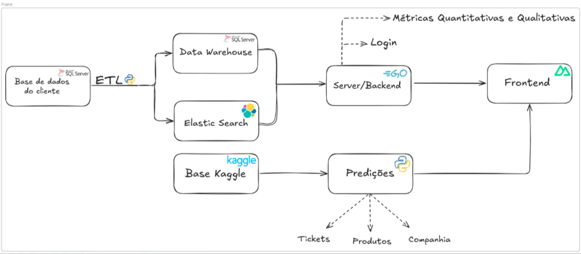
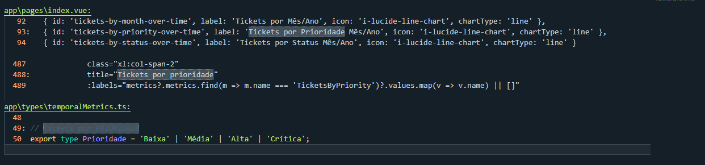

# **Vision Data**

---

### **6º Semestre • Projeto Integrador Fatec-SJC**  

#### **Cliente:** Pro4tech

>A empresa Pro4tech se trata de uma code house dedicada a transformação digital de empresas de terceiros, desenvolvendo soluções inteligentes para controles de recursos humanos, BI, Aplicações WEB, IA, IOT e DEVOPS, com base nas necessidades de seus clientes, e entre seus cases de sucesso estão empresas como Toyota e PVP (Pro Variable Pay)

## Problema Proposto

O cliente em questão possuia a  necessidade de criação de uma solução que realizasse o levantamento de dados desorganizados, padronizando uma visualização mais rápida e assertiva, por meio de um BI, centralizado e organizado.
Além disso, também era do interesse do cliente a possibilidade de visualização e exportação de insights preditivos que pudessem auxiliar na gestão e desta forma reduzindo retrabalhos e melhorando a estratégia de tomadas de decisão

#### Solução apresentada

---

Foi entregue uma aplicação Web que cumpria a todos os requisitos alinhados ao cliente, entregando uma ferramenta em adesão com LGPD, que possuia uma interface adaptável, que entregue os dados relevantes de uma forma centralizada e concisa, que além da beleza, consegue entregar insights valiosos para uma boa estratégia de tomadas de decisão.
Sendo os requisitos funcionais concluídos abaixo:

- **Permitir busca de tickets por palavras-chave.**
- **Processar e anonimizar dados conforme LGPD antes do uso.**
- **Revogar permissão de uso de dados e anonimizar quando solicitado.**
- **Gerar insights a partir do histórico para melhorias (dashboards).**
- **Gerar insights sugestivos com base no uso da ferramenta, sem depender de dashboards.**
- **Controlar acesso baseado em papéis, permitindo gestão apenas por usuários autorizados.**

Além destes temos os seguintes requisitos não funcionais:

- **Garantir segurança e acesso seguro, permitindo apenas usuários autorizados visualizarem ou gerenciarem dados sensíveis.**
- **Assegurar conformidade total com LGPD e leis de proteção de dados, incluindo logs, gestão de dados pessoais e backups.**
- **Oferecer interface intuitiva e fácil de usar, com dashboards claros e manual acessível.**
- **Garantir confiabilidade e manutenção, com alta disponibilidade, backups periódicos e logs detalhados para auditoria e recuperação.**

#### Tecnologias Utilizadas

| Tecnologia | Motivo de uso |
| --- | --- |
| | Linguagem principal no backend, com uma API REST, para integração ao frontend.  |
|  | Framework Web utilizado para construção de nosso frontend.|
| | Motor de busca para massa de dados, servindo principalmente a funções de busca por palavra chave e afins.
| | Utilizado principalmente para a criação de ETL e obtenção de dados, além da criação de nossos algoritmos de predição.  
| | Utilizado para registros de logs na aplicação.
| | Utilizado para criação, manutenção, treinamentos e visualização de nossos modelos de Machine Learning.
|  | Utilizado como banco de dados principal da aplicação, alocando nosso data warehouse.
|  | Utilizado como base para os dados para treinamento treinamento de ML e visualização em dashboard.|
|| Utilizado primariamente para criação de tasks, controle de produtividade e alinhamento aos requisitos. |
 | Utilizado primariamente como versionamento de códigos, ramificações de branchs e afins. |

VER MAIS DETALHES

#### Minhas Contribuições

> **Função:** Scrum Master (SM) – primeira experiência na função. Foco em organização da equipe, tasks e documentação.

1. **Controle de tasks**  
   - Criação e priorização de tasks com base nas histórias de usuário.  
   - Gerenciamento de prazos de tasks e auxílio de usuários em empecilhos e gargalos.
2. **Criação de documentações diversas**  
   - Criação de documento de diretrizes da equipe. <a href="https://github.com/iNineBD/VisionData-6Sem2025Main/wiki/Diretrizes-da-API"> clique aqui para conferir </a>
   > Neste tópico está incluso a inserção de diretrizes para padronização de branchs, commits, agenda de reuniões, regras técnicas e não técnicas para bom convívio, validados internamente com o grupo.
   - Criação de manual de usuário de usuário <a href="https://github.com/iNineBD/VisionData-6Sem2025Main/wiki/User-Manual-‐-EN"> clique aqui para conferir </a>
   - Criação de wikis
3. **Participação e organização efetiva de reuniões de alinhamento**
   - Realização de dailys
   - Realização de sprints review
   - Realização de reuniões de alinhamento junto ao professor M2
4. **Criação de gráficos (FRONTEND)**
   - Criação de contadores de contagem de tickets
   
Evidências</sumarry>
   

   
   
   >_demonstrativo de funcionamento de tela_
   
   

   - Criação de gráfico tabular
    
Evidências</sumarry>
    

      
   >_demonstrativo de tela_

      

5. **Criação de SonarCloud**
    - Criação e acompanhamento de SonarCloud.

#### Conhecimentos Obtidos

Durante esse projeto, meu papel foi inteiramente voltado a gestão, obtendo maior conhecimento sobre os deveres e responsabilidades para com a parte de gestão do time, tendo um papel técnico voltado menos a programação e mais a qualidade de processos estabelecidos, aprazamentos e resolução de gargalos.
